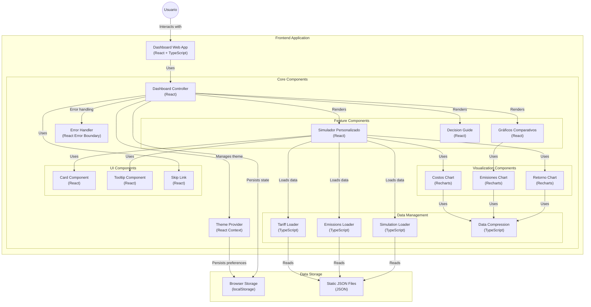

# Data Persistence Migration Roadmap 📦

## Overview

This roadmap outlines the systematic migration of hardcoded data to JSON files, implementation of schema validation, and development of comprehensive testing suites.

## Phase 1: Tariff Data Migration 🔄

### 1.1 Schema Validation

- [X] Review existing tariffSchema.ts implementation
- [X] Document all required tariff data fields and validations
- [X] Create sample JSON data structure based on schema

### 1.2 Data Migration

- [X] Create initial tariffs.json file in src/data/
- [X] Migrate existing hardcoded tariff data to JSON format
- [X] Implement data loading mechanism

### 1.3 Testing Suite

- [X] Create unit tests for schema validation
- [X] Implement data loading tests
- [X] Add error handling tests for invalid data

## Phase 2: Simulation Parameters Migration 🎯

### 2.1 Schema Implementation

- [X] Review simulationParamsSchema.ts structure
- [X] Document component configuration requirements
- [X] Design JSON structure for simulation parameters

### 2.2 Configuration Migration

- [X] Create simulationParams.json in src/data/
- [X] Migrate component configurations to JSON
- [X] Implement configuration loading system

### 2.3 Testing Implementation

- [X] Develop unit tests for parameter validation
- [X] Create integration tests for configuration loading
- [X] Add error boundary tests

## Phase 3: Emissions Data Migration 🌱

### 3.1 Schema Preparation

- [X] Review emissionsSchema.ts implementation
- [X] Document emissions data requirements
- [X] Design JSON structure for emissions data

### 3.2 Data Migration

- [X] Create emissions.json in src/data/
- [X] Migrate emissions and conversion factors
- [X] Implement data loading utilities

### 3.3 Testing Suite

- [X] Create unit tests for emissions data validation
- [X] Implement integration tests for data persistence
- [X] Add performance tests for data loading

## Quality Assurance Checklist ✅

### Documentation

- [X] Update API documentation
  - Document all loader functions (tariffLoader, simulationParamsLoader, emissionsLoader)
  - Create API reference for schema validation functions
  - Update component documentation to reflect new data sources
- [X] Add data migration guides
  - Create step-by-step guide for migrating hardcoded data
  - Document JSON structure requirements and best practices
  - Provide examples of before/after migration code
- [X] Document testing procedures
  - Create testing strategy documentation
  - Document test coverage requirements
  - Add troubleshooting guide for common validation errors

### Testing Coverage

- [X] Achieve >90% test coverage for data validation
  - Implement comprehensive unit tests for all schema validators
  - Add edge case testing for malformed data
  - Create snapshot tests for expected data structures
- [X] Complete E2E tests for data loading
  - Implement full application flow tests with JSON data
  - Test data loading performance in production-like environment
  - Verify component rendering with loaded data
- [X] Implement error handling coverage
  - Test error boundaries for invalid data scenarios
  - Verify user-friendly error messages
  - Implement graceful fallbacks for missing data

### Performance Metrics

- [X] Measure data loading performance
  - Benchmark JSON loading times vs. hardcoded data
  - Profile memory usage during data loading
  - Identify and optimize bottlenecks in validation process
- [X] Optimize JSON file sizes
  - Implement data compression techniques where appropriate
  - Remove redundant data structures
  - Consider lazy loading for large datasets
- [X] Monitor runtime validation impact
  - Measure validation overhead in component rendering
  - Implement caching strategies for validated data
  - Create performance monitoring dashboard

## Implementation Best Practices 🛠️

### Code Organization

- [X] Centralize all data loaders in a single utilities directory
- [X] Implement consistent error handling across all loaders
- [X] Create clear separation between data loading and business logic

### Validation Strategy

- [X] Implement validation at data loading time, not at runtime
- [X] Cache validation results to improve performance
- [X] Provide detailed error messages for validation failures

### Monitoring and Maintenance

- [X] Set up monitoring for data loading performance
- [X] Create automated tests for data integrity
- [X] Document process for adding new data fields

## Success Criteria 🎯

1. [X] All hardcoded data successfully migrated to JSON
2. [X] Complete schema validation implementation
3. [X] Comprehensive test coverage
4. [X] Documented migration process
5. [X] Improved maintainability and scalability

## Diagrama del resutlado de esta rama

