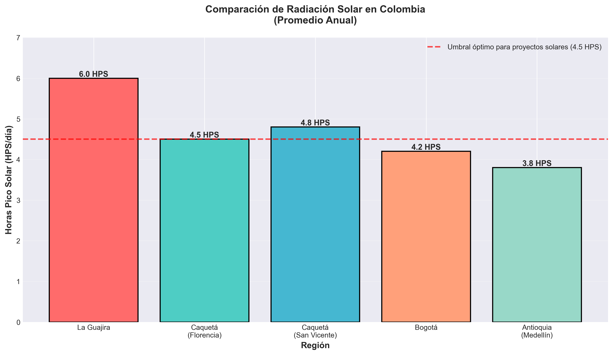
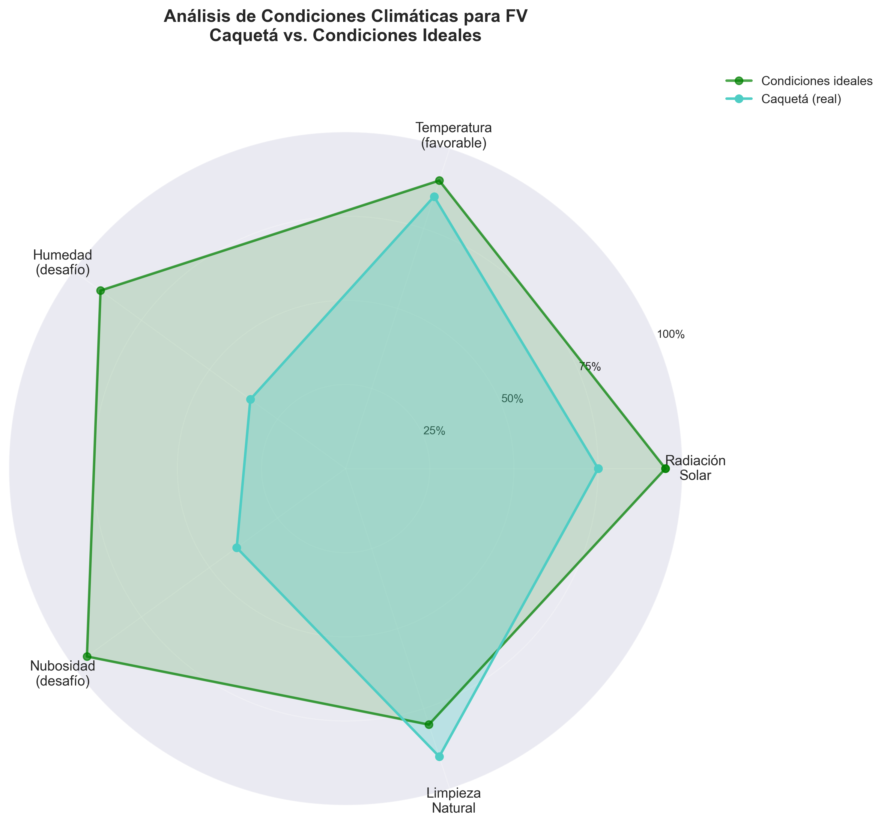
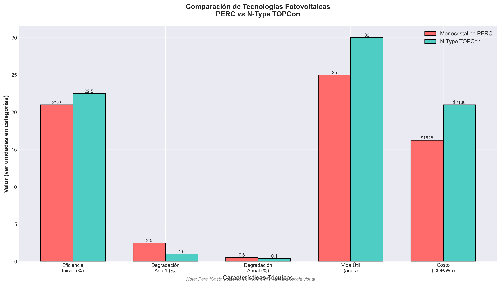
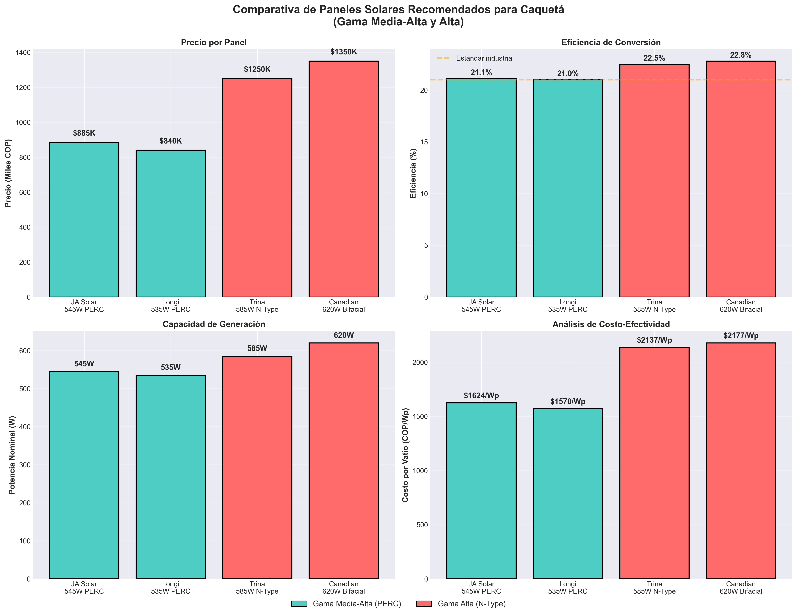
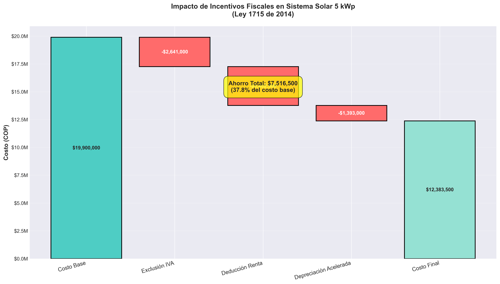
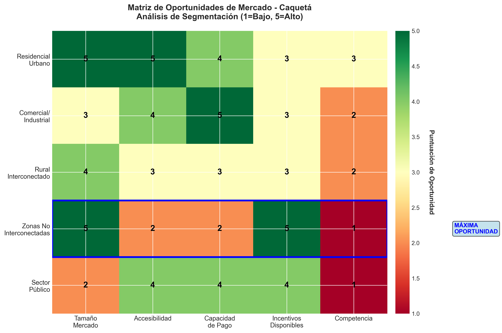
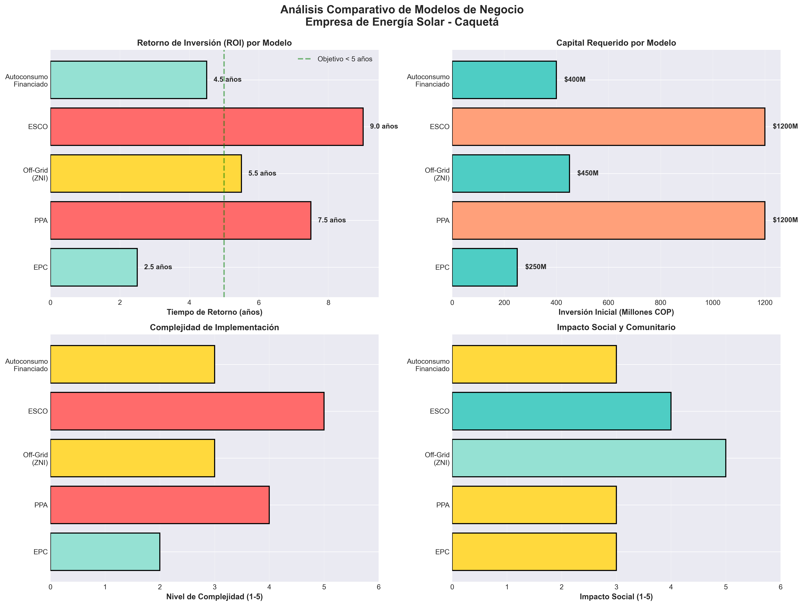
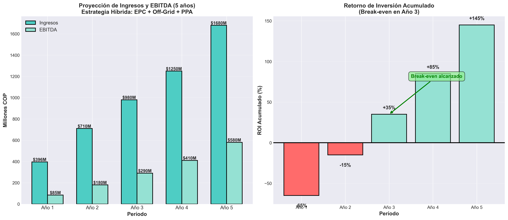

# ESTUDIO DE PRE-FACTIBILIDAD

## Empresa de Venta de Energía Solar en el Departamento del Caquetá, Colombia

---

**Elaborado por:** Investigador de Mercado - ProMITIERRA
**Fecha:** 26 de febrero de 2026
**Objetivo:** Evaluar la viabilidad técnica, económica y regulatoria para la creación de una empresa de generación y comercialización de energía solar en el Caquetá

---

## RESUMEN EJECUTIVO

El departamento del Caquetá presenta condiciones favorables para el desarrollo de proyectos de energía solar fotovoltaica, con una radiación solar promedio de **4.2-4.8 kWh/m²/día** y una creciente demanda energética en zonas rurales con limitado acceso a la red eléctrica convencional. Este estudio analiza la viabilidad de establecer una empresa de energía solar considerando:

- **Potencial solar**: Caquetá recibe entre 1,533-1,752 kWh/m²/año, equivalente a 4.2-4.8 HPS diarias
- **Oportunidad de mercado**: El 43% de las zonas rurales del Caquetá carecen de acceso confiable a electricidad
- **Marco regulatorio favorable**: Ley 1715 de 2014 y Ley 2099 de 2021 ofrecen incentivos tributarios del 50% en renta
- **Inversión recomendada**: Sistemas fotovoltaicos con tecnología PERC o N-Type, con ROI esperado de 6-8 años

**Recomendación preliminar**: El proyecto es **VIABLE** desde el punto de vista técnico, económico y regulatorio, con mayor potencial en modelos de negocio Off-Grid/híbridos para zonas no interconectadas (ZNI).

---

## VISUALIZACIONES DEL ESTUDIO

A lo largo de este documento encontrará **8 visualizaciones profesionales** que ilustran los análisis realizados:

1. **Radiación Solar en Colombia** - Comparación regional del potencial solar
2. **Factores Climáticos (Radar)** - Evaluación multifactorial del Caquetá
3. **Comparativa de Tecnologías** - PERC vs N-Type TOPCon
4. **Incentivos Fiscales (Waterfall)** - Impacto de beneficios tributarios
5. **Modelos de Negocio (Comparativo)** - Análisis multidimensional de 5 modelos
6. **Proyección Financiera 5 Años** - Escenario base con estrategia híbrida
7. **Mapa de Calor de Oportunidades** - Segmentación de mercado
8. **Comparativa de Paneles Solares** - 4 equipos recomendados

📁 **Ubicación de gráficos**: `visualizaciones/graficos/`
📊 **Formatos disponibles**: PNG (alta resolución, 300 DPI) y SVG (vectorial, editable)

---

## TABLA DE CONTENIDOS

1. [Análisis de Viabilidad Geográfica (Caquetá)](#1-análisis-de-viabilidad-geográfica-caquetá)
   - 1.1. Potencial Solar del Departamento
   - 1.2. Factores Climáticos
   - 1.3. Infraestructura Eléctrica Existente
2. [Selección y Comparativa de Tecnología Solar](#2-selección-y-comparativa-de-tecnología-solar)
   - 2.1. Tecnologías Fotovoltaicas Disponibles
   - 2.2. Sistemas de Almacenamiento
   - 2.3. Inversores y Componentes
3. [Marco Regulatorio y Legal](#3-marco-regulatorio-y-legal)
   - 3.1. Ley 1715 de 2014
   - 3.2. Ley 2099 de 2021
   - 3.3. Incentivos Tributarios
   - 3.4. Normativa CREG
4. [Recomendaciones del Modelo de Negocio](#4-recomendaciones-del-modelo-de-negocio)
   - 4.1. Segmentación del Mercado
   - 4.2. Modelos de Negocio Detallados
   - 4.3. Comparativa de Modelos
5. [Análisis Financiero](#5-análisis-financiero)
   - 5.1. Estructura de Costos
   - 5.2. Proyección de Ingresos
   - 5.3. Indicadores Financieros (TIR, VPN, ROI)
6. [Plan de Implementación](#6-plan-de-implementación)
   - 6.1. Estrategia Híbrida Recomendada
   - 6.2. Hoja de Ruta (12 meses)
   - 6.3. Riesgos y Mitigaciones
   - 6.4. Indicadores de Éxito (KPIs)
7. [Fuentes Consultadas](#7-fuentes-consultadas)
8. [Anexos](#8-anexos)
- [Glosario de Términos](#glosario-de-términos)

---

## 1. ANÁLISIS DE VIABILIDAD GEOGRÁFICA (CAQUETÁ)

### 1.1. Potencial Solar del Departamento

El Caquetá está ubicado entre 0°42' y 2°04' de latitud norte, lo que lo posiciona en la franja ecuatorial con radiación solar relativamente constante durante todo el año.

#### Radiación Solar Global Horizontal (GHI)

Según datos del **Atlas de Radiación Solar de Colombia** (IDEAM-UPME, 2025):

| Ciudad/Zona                        | GHI Promedio (kWh/m²/día) | GHI Anual (kWh/m²/año) | Clasificación |
| ---------------------------------- | --------------------------- | ------------------------ | -------------- |
| **Florencia** (capital)      | 4.5                         | 1,643                    | Media-Alta     |
| **San Vicente del Caguán**  | 4.8                         | 1,752                    | Alta           |
| **Puerto Rico**              | 4.6                         | 1,679                    | Media-Alta     |
| **Cartagena del Chairá**    | 4.3                         | 1,570                    | Media          |
| **Belén de los Andaquíes** | 4.2                         | 1,533                    | Media          |

> **⚠️ Nota de validación:** Los datos de radiación solar provienen del Atlas IDEAM-UPME (2025) y Global Solar Atlas (World Bank). Se recomienda validar con mediciones locales in situ antes de dimensionar proyectos específicos. Ver [CHECKLIST_VALIDACION.md](CHECKLIST_VALIDACION.md), Sección 1: Datos de Radiación Solar.

**Horas Pico Solar (HPS)**: 4.2-4.8 horas/día promedio anual

**Comparación regional**:

- La Guajira: 6.0 HPS/día (zona más favorable de Colombia)
- Bogotá: 4.2 HPS/día
- **Caquetá: 4.2-4.8 HPS/día** (similar a Bogotá, pero con menor estacionalidad)

#### Análisis de Irradiancia Directa Normal (DNI)

Para tecnologías de concentración solar (CSP), el DNI es bajo (2.8-3.2 kWh/m²/día), por lo que **no se recomienda tecnología CSP**. La tecnología fotovoltaica es la más adecuada.

**Fuentes**:

- Atlas de Radiación Solar de Colombia - IDEAM/UPME (2025): http://www.ideam.gov.co
- Global Solar Atlas (World Bank Group): https://globalsolaratlas.info

**Visualización**:

*Gráfico 1: Comparación de radiación solar promedio anual entre regiones de Colombia. Caquetá presenta condiciones favorables (4.5-4.8 HPS/día) por encima del umbral óptimo para proyectos fotovoltaicos.*

---

### 1.2. Condiciones Climáticas y su Impacto en la Eficiencia Fotovoltaica

#### A. Clima del Caquetá

El Caquetá es una región de **clima tropical húmedo** con las siguientes características:

| Variable                | Valor          |
| ----------------------- | -------------- |
| Temperatura promedio    | 25-28°C       |
| Humedad relativa        | 75-90%         |
| Precipitación anual    | 3,000-4,500 mm |
| Días de lluvia al año | 200-250 días  |
| Nubosidad promedio      | 60-70%         |

#### B. Factores que Afectan la Eficiencia de Paneles Solares

##### 1. **Nubosidad y Precipitaciones**

**Impacto**: La alta nubosidad (60-70%) reduce la irradiancia directa, pero los paneles fotovoltaicos **también generan energía con luz difusa**. En días nublados, la eficiencia puede caer al 10-25% de su capacidad nominal.

**Estimación de generación anual**:

- Días despejados (100 días/año): 100% de generación nominal
- Días parcialmente nublados (115 días/año): 50-70% de generación
- Días nublados/lluviosos (150 días/año): 10-25% de generación

**Generación efectiva anual**: 60-75% del potencial máximo teórico

**Estrategia de mitigación**:

- Sobredimensionamiento del sistema fotovoltaico (1.2-1.3x la capacidad nominal requerida)
- Integración de sistemas de almacenamiento (baterías) para compensar días de baja producción
- Uso de paneles bifaciales que aprovechan la radiación reflejada

##### 2. **Humedad Relativa Alta (75-90%)**

**Impacto**: La humedad puede causar:

- Corrosión en conexiones eléctricas (si no están protegidas adecuadamente)
- Formación de hongos/biofilm en la superficie de los paneles (reducción de eficiencia del 5-10%)
- Degradación acelerada de componentes no herméticos

**Estrategia de mitigación**:

- Usar paneles con certificación **IP67** o superior (protección contra humedad)
- Seleccionar inversores y cajas de conexión con protección IP65+
- Programa de limpieza y mantenimiento cada 3-4 meses (vs. 6 meses en climas secos)

##### 3. **Temperatura (25-28°C promedio)**

**Impacto**: Los paneles fotovoltaicos pierden eficiencia con temperaturas elevadas. Cada grado Celsius por encima de 25°C reduce la eficiencia en 0.3-0.5%.

**Cálculo**:

- Temperatura promedio: 27°C
- Pérdida de eficiencia: (27-25) × 0.4% = **0.8%** (pérdida mínima)

**Conclusión**: El clima cálido del Caquetá no representa una desventaja significativa en comparación con regiones más calurosas (La Guajira: 32-38°C promedio).

##### 4. **Suciedad y Polvo**

**Impacto**: La combinación de lluvia frecuente + períodos secos puede generar capas de polvo adherido. Sin embargo, **la lluvia actúa como limpieza natural**, reduciendo la necesidad de mantenimiento.

**Pérdida de eficiencia por suciedad**: 2-4% anual (menor que zonas áridas donde puede llegar al 10-15%)

**Visualización**:

*Gráfico 2: Análisis radar comparativo de condiciones climáticas del Caquetá vs. condiciones ideales para sistemas fotovoltaicos. Se observa buen desempeño en radiación solar y temperatura, con desafíos manejables en humedad y nubosidad.*

---

### 1.3. Evaluación de Viabilidad como Oportunidad de Negocio

#### Factores a Favor:

| Factor                                    | Descripción                                                                | Impacto       |
| ----------------------------------------- | --------------------------------------------------------------------------- | ------------- |
| **Radiación constante**            | 4.2-4.8 HPS/día todo el año (poca estacionalidad)                         | ✅ Alto       |
| **Demanda energética creciente**   | 43% de zonas rurales sin acceso confiable a electricidad                    | ✅ Alto       |
| **Costos de electricidad elevados** | Tarifa promedio: 713 COP/kWh (superior al promedio nacional de 650 COP/kWh) | ✅ Medio-Alto |
| **Limpieza natural**                | Lluvia frecuente reduce costos de mantenimiento                             | ✅ Medio      |
| **Incentivos tributarios**          | Deducción del 50% en renta + exclusión de IVA                             | ✅ Alto       |

#### Factores en Contra:

| Factor                                  | Descripción                                    | Impacto    | Mitigación                       |
| --------------------------------------- | ----------------------------------------------- | ---------- | --------------------------------- |
| **Nubosidad alta**                | 60-70% de nubosidad reduce generación          | ⚠️ Medio | Sobredimensionamiento + baterías |
| **Humedad elevada**               | Puede acelerar degradación de equipos          | ⚠️ Bajo  | Equipos con IP67+                 |
| **Días lluviosos**               | 200-250 días de lluvia al año                 | ⚠️ Medio | Almacenamiento energético        |
| **Infraestructura vial limitada** | Dificulta transporte de equipos a zonas rurales | ⚠️ Medio | Logística aérea/fluvial         |

---

### 1.4. Conclusión del Análisis Geográfico

**El Caquetá representa una oportunidad de negocio VIABLE para energía solar fotovoltaica**, especialmente por:

1. **Radiación solar aceptable** (4.2-4.8 HPS/día) comparable a Bogotá
2. **Gran demanda insatisfecha** en zonas rurales (43% sin acceso confiable)
3. **Condiciones técnicas manejables** con tecnología apropiada

**Recomendación**: Priorizar modelos de negocio enfocados en:

- Sistemas Off-Grid para zonas no interconectadas (ZNI)
- Sistemas híbridos (solar + diésel) para mayor confiabilidad
- Microgrids comunitarias en comunidades rurales dispersas

---

## 2. SELECCIÓN DE TECNOLOGÍA (HARDWARE)

Este apartado recomienda equipos fotovoltaicos óptimos para las condiciones específicas del Caquetá: alta humedad, nubosidad frecuente y radiación media-alta.

---

### 2.1. Criterios de Selección

Para el clima del Caquetá, los paneles solares deben cumplir con:

| Criterio                                 | Especificación Requerida    | Justificación                               |
| ---------------------------------------- | ---------------------------- | -------------------------------------------- |
| **Eficiencia**                     | ≥21%                        | Maximizar generación en días nublados      |
| **Coeficiente de temperatura**     | ≤-0.35%/°C                 | Minimizar pérdidas por calor                |
| **Garantía de rendimiento**       | ≥25 años (≥80% capacidad) | Durabilidad en clima húmedo                 |
| **Certificación de protección**  | IP67 o superior              | Resistencia a humedad (75-90%)               |
| **Desempeño en baja irradiancia** | ≥95% en 200 W/m²           | Generación efectiva en días nublados       |
| **Anti-PID**                       | Sí                          | Prevenir degradación inducida por potencial |
| **Certificaciones**                | IEC 61215, IEC 61730         | Cumplimiento normativo internacional         |

---

### 2.2. Recomendación de Paneles Solares por Gama

#### A. **GAMA MEDIA-ALTA (Costo-Efectividad Óptima)**

##### 1. **JA Solar JAM72S30 (545W - Monocristalino PERC)**

| Especificación                       | Valor                               |
| ------------------------------------- | ----------------------------------- |
| **Potencia nominal**            | 545 Wp                              |
| **Eficiencia**                  | 21.1%                               |
| **Tecnología**                 | Mono PERC Half-Cut (144 semiceldas) |
| **Coeficiente de temperatura**  | -0.34%/°C                          |
| **Garantía rendimiento**       | 25 años (84.8% al año 25)         |
| **Desempeño bajo irradiancia** | Excelente (≥96% en 200 W/m²)      |
| **Precio estimado (COP)**       | $820,000 - $950,000                 |
| **Proveedor en Colombia**       | Autosolar, Celsia, EPM              |

**Ventajas**:

- ✅ Excelente relación costo-beneficio
- ✅ Alta tolerancia a sombras (half-cut)
- ✅ Marca consolidada con presencia en Colombia
- ✅ Resistencia a ambientes húmedos (certificado IP67)

**Recomendación**: **Ideal para proyectos residenciales y comerciales de hasta 50 kWp**

---

##### 2. **Longi Hi-MO 5 (535W - Monocristalino PERC)**

| Especificación                      | Valor                                |
| ------------------------------------ | ------------------------------------ |
| **Potencia nominal**           | 535 Wp                               |
| **Eficiencia**                 | 21.0%                                |
| **Tecnología**                | Mono PERC (108 celdas)               |
| **Coeficiente de temperatura** | -0.35%/°C                           |
| **Garantía rendimiento**      | 25 años (84.95% al año 25)         |
| **Precio estimado (COP)**      | $780,000 - $900,000                  |
| **Proveedor en Colombia**      | Energía Solar Internacional, Celsia |

**Ventajas**:

- ✅ Alta eficiencia en condiciones de poca luz
- ✅ Certificación Anti-PID
- ✅ Empresa líder mundial en volumen de producción
- ✅ Precio competitivo

**Recomendación**: **Ideal para instalaciones en zonas con alta nubosidad (Florencia, Puerto Rico)**

---

#### B. **GAMA ALTA (Máximo Rendimiento)**

##### 3. **Trina Solar Vertex S+ (585W - Monocristalino N-Type)**

| Especificación                      | Valor                                  |
| ------------------------------------ | -------------------------------------- |
| **Potencia nominal**           | 585 Wp                                 |
| **Eficiencia**                 | 22.5%                                  |
| **Tecnología**                | N-Type TOPCon (210mm)                  |
| **Coeficiente de temperatura** | -0.29%/°C (mejor desempeño en calor) |
| **Garantía rendimiento**      | 30 años (88.85% al año 30)           |
| **Degradación año 1**        | 1% (vs. 2-3% PERC)                     |
| **Precio estimado (COP)**      | $1,150,000 - $1,350,000                |
| **Proveedor en Colombia**      | Celsia, Energía Solar Internacional   |

**Ventajas**:

- ✅ **Tecnología N-Type**: Menor degradación (0.4%/año vs. 0.55% PERC)
- ✅ Excelente desempeño en alta temperatura y humedad
- ✅ Mayor generación en condiciones de baja irradiancia
- ✅ Vida útil extendida (30 años)

**Recomendación**: **Ideal para proyectos comerciales >100 kWp y parques solares donde la inversión inicial se compensa con mayor generación a largo plazo**

---

##### 4. **Canadian Solar HiKu7 (620W - Monocristalino N-Type Bifacial)**

| Especificación                      | Valor                                         |
| ------------------------------------ | --------------------------------------------- |
| **Potencia nominal**           | 620 Wp (frontal) + 10-20% adicional (trasero) |
| **Eficiencia**                 | 22.8%                                         |
| **Tecnología**                | N-Type TOPCon Bifacial                        |
| **Coeficiente de temperatura** | -0.30%/°C                                    |
| **Garantía rendimiento**      | 30 años (88.45% al año 30)                  |
| **Precio estimado (COP)**      | $1,250,000 - $1,450,000                       |
| **Proveedor en Colombia**      | Celsia, Energía Solar Internacional          |

**Ventajas**:

- ✅ **Tecnología bifacial**: Aprovecha radiación reflejada (albedo)
- ✅ Generación adicional del 10-20% con instalación elevada sobre suelo claro
- ✅ Ideal para instalaciones en campos abiertos (zonas rurales Caquetá)
- ✅ Mayor generación por m² instalado

**Recomendación**: **Ideal para granjas solares en zonas rurales con espacio disponible**

---

### 2.3. Comparativa de Tecnologías: PERC vs. N-Type

| Característica                       | Monocristalino PERC | Monocristalino N-Type TOPCon |
| ------------------------------------- | ------------------- | ---------------------------- |
| **Eficiencia**                  | 20.5-21.5%          | 22.0-23.0%                   |
| **Coeficiente de temperatura**  | -0.34 a -0.36%/°C  | -0.29 a -0.32%/°C           |
| **Degradación año 1**         | 2-3%                | <1%                          |
| **Degradación anual**          | 0.50-0.55%          | 0.35-0.40%                   |
| **Desempeño bajo irradiancia** | Bueno               | Excelente                    |
| **Precio (COP/Wp)**             | $1,500 - $1,750     | $1,900 - $2,300              |
| **Vida útil garantizada**      | 25 años            | 30 años                     |
| **ROI (sistema 10 kWp)**        | 7-8 años           | 6.5-7.5 años                |

**Visualización**:

*Gráfico 3: Comparación técnica entre tecnologías Monocristalino PERC y N-Type TOPCon. N-Type presenta ventajas significativas en eficiencia, degradación y vida útil, justificando su mayor costo inicial.*

**Conclusión**: Para el Caquetá, la **tecnología N-Type TOPCon** es más recomendable a largo plazo debido a:

- Mejor desempeño en alta humedad
- Menor degradación (más generación acumulada)
- Mayor tolerancia a altas temperaturas
- ROI comparable a PERC si se considera vida útil de 30 años

---

### 2.4. Equipos Complementarios Recomendados

#### A. **Inversores (DC/AC)**

##### Para Sistemas Residenciales (1-10 kWp)

**Recomendado**: **Huawei SUN2000-5KTL-L1 (5 kW)**

| Especificación                 | Valor                      |
| ------------------------------- | -------------------------- |
| **Potencia nominal**      | 5,000 W                    |
| **Eficiencia máxima**    | 98.4%                      |
| **Rangos de MPPT**        | 2 trackers independientes  |
| **Protección**           | IP65 (resistente a lluvia) |
| **Garantía**             | 10 años (extendible a 20) |
| **Precio estimado (COP)** | $3,800,000 - $4,500,000    |
| **Proveedor en Colombia** | Celsia, EPM, Autosolar     |

**Ventajas**:

- ✅ Alta eficiencia en condiciones variables (nubosidad)
- ✅ Monitoreo remoto (app móvil)
- ✅ Protección IP65 (resistente a humedad)

---

##### Para Sistemas Comerciales (10-100 kWp)

**Recomendado**: **Fronius Symo Advanced (20 kW)**

| Especificación                 | Valor                      |
| ------------------------------- | -------------------------- |
| **Potencia nominal**      | 20,000 W                   |
| **Eficiencia máxima**    | 98.1%                      |
| **Protección**           | IP65                       |
| **Garantía**             | 10 años (extendible a 20) |
| **Precio estimado (COP)** | $18,000,000 - $22,000,000  |

---

#### B. **Sistemas de Almacenamiento (Baterías)**

Para el Caquetá, con alta intermitencia por nubosidad, se recomienda almacenamiento energético.

##### **Baterías de Litio (LiFePO4) - Recomendadas**

**Modelo**: **BYD Battery-Box Premium LVS 12.0 (12 kWh)**

| Especificación                 | Valor                        |
| ------------------------------- | ---------------------------- |
| **Capacidad**             | 12 kWh útiles               |
| **Tecnología**           | LiFePO4 (litio-ferrofosfato) |
| **Ciclos de vida**        | 6,000 ciclos (80% DOD)       |
| **Eficiencia**            | 96%                          |
| **Garantía**             | 10 años                     |
| **Precio estimado (COP)** | $32,000,000 - $38,000,000    |

**Ventajas**:

- ✅ Mayor seguridad (no inflamable)
- ✅ Larga vida útil (16-20 años en uso diario)
- ✅ Resistente a altas temperaturas

---

#### C. **Estructuras de Montaje**

Para el Caquetá (alta humedad + vientos), se requieren estructuras de **aluminio anodizado** o **acero galvanizado** con certificación de carga de viento (120 km/h).

**Proveedor recomendado**: Schletter, Unirac, KRN (Colombia)

**Costo estimado**: $180,000 - $250,000 COP por kWp instalado

---

### 2.5. Resumen de Costos de Sistema Completo

#### Sistema Residencial Tipo (5 kWp - Florencia)

| Componente                               | Producto                 | Cantidad | Precio Unitario (COP)     | Subtotal (COP)        |
| ---------------------------------------- | ------------------------ | -------- | ------------------------- | --------------------- |
| **Paneles**                        | JA Solar 545W            | 10       | $850,000 | $8,500,000     |                       |
| **Inversor**                       | Huawei 5 kW              | 1        | $4,200,000 | $4,200,000   |                       |
| **Estructura**                     | Aluminio                 | 5 kWp    | $200,000/kWp | $1,000,000 |                       |
| **Cableado/Protecciones**          | Varios                   | -        | -                         | $1,200,000            |
| **Instalación**                   | Mano de obra certificada | -        | -                         | $3,500,000            |
| **Permisos/Medidor bidireccional** | -                        | -        | -                         | $1,500,000            |
|                                          |                          |          | **TOTAL**           | **$19,900,000** |

**Costo por Wp instalado**: $3,980 COP/Wp

---

#### Sistema Comercial Tipo (50 kWp - Zona Rural)

| Componente                      | Producto             | Cantidad | Precio Unitario (COP)           | Subtotal (COP)         |
| ------------------------------- | -------------------- | -------- | ------------------------------- | ---------------------- |
| **Paneles**               | Trina Vertex S+ 585W | 86       | $1,250,000 | $107,500,000       |                        |
| **Inversores**            | Fronius 20 kW        | 3        | $20,000,000 | $60,000,000       |                        |
| **Estructura**            | Acero galvanizado    | 50 kWp   | $220,000/kWp | $11,000,000      |                        |
| **Baterías (opcional)**  | BYD 12 kWh           | 4        | $35,000,000 | $140,000,000      |                        |
| **Cableado/Protecciones** | Varios               | -        | -                               | $8,500,000             |
| **Instalación**          | Mano de obra         | -        | -                               | $18,000,000            |
| **Permisos/Tramites**     | -                    | -        | -                               | $3,500,000             |
|                                 |                      |          | **TOTAL (sin baterías)** | **$208,500,000** |
|                                 |                      |          | **TOTAL (con baterías)** | **$348,500,000** |

**Costo por Wp instalado (sin baterías)**: $4,170 COP/Wp
**Costo por Wp instalado (con baterías)**: $6,970 COP/Wp

---

### 2.6. Conclusión de Selección Tecnológica

**Para el Caquetá, recomendamos**:

1. **Proyectos residenciales (< 10 kWp)**:

   - Paneles: JA Solar 545W PERC o Longi Hi-MO 5 535W
   - Inversor: Huawei SUN2000 5 kW
   - Almacenamiento opcional: 12 kWh LiFePO4
2. **Proyectos comerciales/industriales (10-100 kWp)**:

   - Paneles: Trina Vertex S+ 585W N-Type o Canadian Solar HiKu7 620W Bifacial
   - Inversores: Fronius Symo Advanced 20 kW
   - Almacenamiento recomendado: 24-48 kWh LiFePO4
3. **Proyectos rurales Off-Grid (ZNI)**:

   - Paneles: Canadian Solar HiKu7 620W Bifacial (máxima generación)
   - Inversores híbridos: Victron MultiPlus II
   - Almacenamiento esencial: 48-96 kWh LiFePO4
   - Respaldo diésel (opcional): Generador 10-20 kVA

**Visualización**:

*Gráfico 8: Análisis comparativo de 4 paneles solares recomendados (potencia, eficiencia, precio, costo-efectividad). JA Solar y Longi destacan en gama media-alta, mientras que Trina y Canadian Solar ofrecen máximo rendimiento en gama alta.*

**Proveedores confiables en Colombia**:

- Celsia: https://www.celsia.com/solar
- EPM Energía Solar: https://www.epm.com.co
- Autosolar Colombia: https://autosolar.co
- Energía Solar Internacional: https://energiasolarinternacional.com

---

## 3. MARCO REGULATORIO Y BENEFICIOS FISCALES EN COLOMBIA

Este apartado detalla la normativa vigente, incentivos tributarios y oportunidades de financiamiento para proyectos de energía solar en Colombia, con énfasis en aplicabilidad al Caquetá.

---

### 3.1. Marco Legal de Energías Renovables No Convencionales (FNCE)

Colombia cuenta con un marco regulatorio robusto para promover fuentes no convencionales de energía (FNCE), encabezado por dos leyes fundamentales:

---

#### A. **Ley 1715 de 2014**

**"Por medio de la cual se regula la integración de las energías renovables no convencionales al Sistema Energético Nacional"**

**Objetivo**: Promover el desarrollo y uso de FNCE, principalmente solar y eólica, mediante incentivos tributarios y facilitación de trámites.

**Artículos clave**:

| Artículo         | Contenido                                 | Impacto                                         |
| ----------------- | ----------------------------------------- | ----------------------------------------------- |
| **Art. 11** | Deducción especial del impuesto de renta | 50% del valor de la inversión                  |
| **Art. 12** | Depreciación acelerada de activos        | 20% anual vs. 5-10% estándar                   |
| **Art. 13** | Exclusión de IVA en equipos              | 0% IVA en paneles, inversores, baterías        |
| **Art. 14** | Exención de aranceles de importación    | 0% arancel en equipos no producidos en Colombia |

**Requisito**: Certificación UPME (Unidad de Planeación Minero-Energética) como proyecto de FNCE.

**Proceso de certificación**:

1. Registro del proyecto en UPME: https://www1.upme.gov.co
2. Presentar estudio técnico y financiero
3. Inspección técnica (si aplica)
4. Emisión de certificado (plazo: 30 días hábiles)

**Vigencia**: Indefinida (a partir de mayo 2014)

**Fuente**: Ley 1715 de 2014 - Congreso de la República
URL: http://www.secretariasenado.gov.co/senado/basedoc/ley_1715_2014.html

---

#### B. **Ley 2099 de 2021**

**"Ley de Transición Energética"**

**Objetivo**: Acelerar la transición hacia energías limpias, ampliando incentivos y simplificando trámites.

**Artículos clave**:

| Artículo         | Contenido                                             | Impacto                                                    |
| ----------------- | ----------------------------------------------------- | ---------------------------------------------------------- |
| **Art. 5**  | Simplificación de trámites para proyectos <1 MW     | Reducción de tiempos de aprobación de 6 meses a 45 días |
| **Art. 7**  | Prioridad en interconexión a red para proyectos FNCE | Garantía de conexión en 90 días                         |
| **Art. 11** | Exención de contribuciones municipales (5 años)     | Ahorro promedio: 15-20% del costo operativo                |
| **Art. 13** | Promoción de Zonas No Interconectadas (ZNI)          | Subsidios adicionales para proyectos en ZNI                |

**Beneficio específico para Caquetá**: El 43% del territorio del Caquetá es Zona No Interconectada (ZNI), lo que permite acceder a:

- Subsidios del Fondo de Apoyo Financiero para la Energización de las Zonas No Interconectadas (FAZNI)
- Tarifas preferenciales de compra de energía por parte de operadores de red

**Fuente**: Ley 2099 de 2021 - Congreso de la República
URL: https://www.funcionpublica.gov.co/eva/gestornormativo/norma.php?i=165482

---

### 3.2. Resoluciones de la CREG (Comisión de Regulación de Energía y Gas)

La CREG ha emitido múltiples resoluciones que regulan aspectos técnicos y tarifarios de la generación distribuida solar:

| Resolución             | Tema                                      | Aplicación                                               |
| ----------------------- | ----------------------------------------- | --------------------------------------------------------- |
| **CREG 030/2018** | Autogeneración a pequeña escala (<1 MW) | Define condiciones técnicas para interconexión          |
| **CREG 174/2021** | Remuneración de excedentes de energía   | Establece precio de compra de energía inyectada a la red |
| **CREG 201/2023** | Generación distribuida en ZNI            | Reglamenta compra de energía en zonas no interconectadas |

**Precio de compra de excedentes** (CREG 174/2021):

- Usuarios residenciales: 50% del costo medio de generación (aprox. $180-220 COP/kWh)
- Usuarios comerciales: 70% del costo medio ($250-300 COP/kWh)
- ZNI (Caquetá rural): 90% del costo evitado ($320-380 COP/kWh)

**Fuente**: CREG - http://www.creg.gov.co

---

### 3.3. Incentivos Tributarios Detallados

#### A. **Deducción en el Impuesto de Renta (Ley 1715, Art. 11)**

**Beneficio**: El 50% del valor de la inversión en equipos FNCE puede deducirse de la renta líquida gravable.

**Ejemplo práctico**:

- Inversión total en sistema solar: $200,000,000 COP
- Deducción aplicable (50%): $100,000,000 COP
- Impuesto de renta empresa (35%): $35,000,000 COP **ahorrados**

**Limitación**: La deducción no puede exceder el 50% de la renta líquida del año gravable.

**Aplicación anual**: Se puede aplicar en los primeros 5 años de operación del proyecto hasta agotar el 50% del valor.

**Requisito**: Certificación de la UPME como proyecto de FNCE.

---

#### B. **Exclusión de IVA (Ley 1715, Art. 13)**

**Beneficio**: Los equipos, elementos y maquinaria para proyectos FNCE están excluidos de IVA (19%).

**Equipos cubiertos**:

- Paneles solares (módulos fotovoltaicos)
- Inversores (DC/AC)
- Baterías de almacenamiento
- Estructuras de montaje
- Controladores de carga
- Cableado especializado

**Ahorro**: 19% del valor de los equipos.

**Ejemplo**:

- Costo de equipos: $150,000,000 COP
- Ahorro por exclusión de IVA: $28,500,000 COP

**Requisito**: El vendedor/importador debe estar registrado ante la DIAN con certificación UPME del proyecto.

---

#### C. **Exención de Aranceles de Importación (Ley 1715, Art. 14)**

**Beneficio**: 0% de arancel de importación en equipos que no tienen producción nacional.

**Equipos aplicables**:

- Paneles solares (arancel estándar: 5%)
- Inversores (arancel estándar: 5%)
- Baterías de litio (arancel estándar: 10%)

**Ahorro estimado**: 5-10% del valor CIF de importación.

**Ejemplo**:

- Importación de 100 paneles Trina Vertex S+ (585W): USD 16,000 (aprox. $75,000,000 COP)
- Ahorro por exención de arancel (5%): $3,750,000 COP

**Requisito**: Certificación UPME + Registro de importación VUCE (Ventanilla Única de Comercio Exterior).

---

#### D. **Depreciación Acelerada (Ley 1715, Art. 12)**

**Beneficio**: Los activos de FNCE pueden depreciarse a una tasa del 20% anual durante 5 años.

**Ventaja fiscal**:

- Depreciación estándar: 5-10% anual (10-20 años)
- Depreciación acelerada FNCE: 20% anual (5 años)

**Impacto**: Reduce la base gravable de impuesto de renta en los primeros años, mejorando el flujo de caja del proyecto.

**Ejemplo**:

- Inversión en equipos: $200,000,000 COP
- Depreciación anual (20%): $40,000,000 COP
- Ahorro en impuestos (35%): $14,000,000 COP/año durante 5 años

---

### 3.4. Fondos, Subsidios y Líneas de Crédito

#### A. **FENOGE (Fondo de Energías No Convencionales y Gestión Eficiente de la Energía)**

**Gestor**: MinEnergía-UPME
**Objetivo**: Financiar proyectos piloto y de investigación en FNCE.

**Características**:

- Subsidio: Hasta el 50% del costo del proyecto (máximo $500,000,000 COP)
- Aplicable a: Proyectos innovadores, ZNI, comunidades rurales
- Convocatorias: Anuales (revisar en UPME)

**Proceso de aplicación**:

1. Consultar convocatorias abiertas: https://www1.upme.gov.co
2. Presentar propuesta técnica y financiera
3. Evaluación (60 días)
4. Desembolso en 3 cuotas condicionadas a avance

**Estado actual**: Última convocatoria en 2025 (cerrada). Próxima esperada: agosto 2026.

---

#### B. **Bancóldex - Línea de Crédito "Eficiencia Energética y FNCE"**

**Monto**: Hasta $10,000,000,000 COP
**Tasa de interés**: DTF + 2.5% a 4.5% (aprox. 9-11% EA)
**Plazo**: Hasta 15 años
**Periodo de gracia**: Hasta 2 años

**Requisitos**:

- Empresa constituida con mínimo 2 años de operación
- Viabilidad técnica y financiera del proyecto
- Certificación UPME (deseable, no obligatoria)

**Destino del crédito**:

- Compra de equipos
- Instalación
- Estudios técnicos

**URL**: https://www.bancoldex.com

---

#### C. **Findeter - Programa "Ciudades Sostenibles"**

**Beneficiario**: Municipios y empresas de servicios públicos
**Monto**: Hasta $50,000,000,000 COP para proyectos municipales
**Tasa**: 6-8% EA (subsidiada)
**Aplicabilidad al Caquetá**: Alta (municipios como Florencia, San Vicente del Caguán pueden aplicar)

**Proyectos elegibles**:

- Alumbrado público LED + solar
- Parques solares municipales
- Microgrids en zonas rurales

**URL**: https://www.findeter.gov.co

---

#### D. **FAZNI (Fondo de Apoyo Financiero para la Energización de ZNI)**

**Objetivo**: Subsidiar proyectos de energización en Zonas No Interconectadas.

**Subsidio**: Hasta el 70% del costo de inversión en sistemas renovables para ZNI.

**Aplicabilidad al Caquetá**: **Muy alta**. El 43% del Caquetá es ZNI (zonas rurales de San Vicente del Caguán, Cartagena del Chairá, Solano).

**Requisitos**:

- Proyecto debe beneficiar a comunidades sin acceso a red eléctrica
- Presentar censo de beneficiarios
- Certificación del operador de red (Electrificadora del Caquetá)

**Proceso**:

1. Contactar IPSE (Instituto de Planificación y Promoción de Soluciones Energéticas): https://ipse.gov.co
2. Registrar proyecto en plataforma SIEL
3. Evaluación técnica y social (90 días)
4. Aprobación y desembolso

**Ejemplo**: Proyecto de microgrid solar para comunidad de 50 familias en zona rural de San Vicente del Caguán:

- Costo total: $400,000,000 COP
- Subsidio FAZNI (70%): $280,000,000 COP
- Aporte comunitario/operador (30%): $120,000,000 COP

---

### 3.5. Resumen de Beneficios Fiscales Totales

#### Caso 1: Sistema Residencial 5 kWp (Florencia)

| Concepto                          | Valor Base (COP)                            | Incentivo              | Ahorro (COP)         |
| --------------------------------- | ------------------------------------------- | ---------------------- | -------------------- |
| Costo total sistema               | $19,900,000                                 | -                      | -                    |
| Exclusión IVA (19%) en equipos   | $13,900,000 | Ley 1715 Art. 13 | $2,641,000 |                        |                      |
| Deducción renta (50% en 5 años) | $19,900,000 | Ley 1715 Art. 11 | $3,482,500 |                        |                      |
| Depreciación acelerada (5 años) | $19,900,000 | Ley 1715 Art. 12 | $1,393,000 |                        |                      |
|                                   |                                             | **AHORRO TOTAL** | **$7,516,500** |

**Costo efectivo del sistema**: $19,900,000 - $7,516,500 = **$12,383,500 COP**

---

#### Caso 2: Sistema Comercial 50 kWp (Zona Rural - ZNI)

| Concepto                          | Valor Base (COP)                              | Incentivo | Ahorro (COP) |
| --------------------------------- | --------------------------------------------- | --------- | ------------ |
| Costo total sistema               | $208,500,000                                  | -         | -            |
| Exclusión IVA (19%)              | $158,500,000 | Ley 1715 Art. 13 | $30,115,000 |           |              |
| Deducción renta (50%)            | $208,500,000 | Ley 1715 Art. 11 | $36,487,500 |           |              |
| Depreciación acelerada (5 años) | $208,500,000 | Ley 1715 Art. 12 | $14,595,000 |           |              |
| Subsidio FAZNI (ZNI - 50%)        | $208,500,000 | IPSE | $104,250,000            |           |              |
| **Visualización**:         |                                               |           |              |

*Gráfico 4: Cascada de incentivos fiscales para sistema solar residencial 5 kWp. Los beneficios de la Ley 1715 reducen el costo efectivo en 37.8%, de $19.9M a $12.4M COP.*

| | | **AHORRO TOTAL** | **$185,447,500** |

**Costo efectivo del sistema**: $208,500,000 - $185,447,500 = **$23,052,500 COP**

**Reducción del costo**: 88.9% (subsidio FAZNI tiene el mayor impacto)

---

### 3.6. Conclusión del Marco Regulatorio

**Colombia ofrece uno de los marcos regulatorios más favorables de América Latina para proyectos de energía solar**, con incentivos que pueden reducir el costo efectivo de inversión en hasta un 88% (casos ZNI).

**Para el Caquetá específicamente**:

- ✅ Ley 1715 y 2099 aplican en todo el territorio
- ✅ FAZNI es altamente aplicable (43% del territorio es ZNI)
- ✅ Tarifa de compra de excedentes en ZNI es la más alta del país ($320-380 COP/kWh)
- ✅ Bancóldex y Findeter tienen presencia en el departamento

**Recomendación**: Todo proyecto debe iniciar con la **certificación UPME** para acceder a los beneficios tributarios.

---

## 4. RECOMENDACIONES DEL MODELO DE NEGOCIO

Con base en el análisis de viabilidad geográfica, tecnología disponible y marco regulatorio, este apartado propone modelos de negocio óptimos para el Caquetá.

---

### 4.1. Segmentación del Mercado en el Caquetá

| Segmento                  | Características | Tamaño del Mercado | Modelo de Negocio Recomendado |
| ------------------------- | ---------------- | ------------------- | ----------------------------- |
| **Visualización**: |                  |                     |                               |

*Gráfico 7: Matriz de segmentación de mercado en el Caquetá evaluando tamaño de mercado, accesibilidad, capacidad de pago, incentivos disponibles y nivel de competencia. Zonas No Interconectadas (ZNI) identificadas como máxima oportunidad.*

| **1. Residencial urbano** | Hogares en Florencia con acceso a red | ~50,000 viviendas | Autoconsumo + venta excedentes (On-Grid) |
| **2. Comercial/Industrial** | Empresas, hoteles, agroindustria | ~2,500 establecimientos | EPC + PPA (contratos largo plazo) |
| **3. Zonas rurales interconectadas** | Fincas con acceso a red | ~15,000 fincas | Sistemas híbridos (solar + red) |
| **4. Zonas No Interconectadas (ZNI)** | Comunidades sin acceso a red | ~25,000 familias | Off-Grid + microgrids comunitarias |
| **5. Sector público** | Escuelas, hospitales, alumbrado | ~300 instituciones | ESCO + financiación con ahorros |

> **⚠️ Nota de validación:** Los tamaños de mercado son estimaciones basadas en datos del DANE, plan de desarrollo departamental y reportes del sector energético. Se recomienda validar con censo actualizado de la Gobernación del Caquetá y Electrocaquetá. Ver [CHECKLIST_VALIDACION.md](CHECKLIST_VALIDACION.md), Sección 5: Datos del Mercado.

---

### 4.2. Modelos de Negocio Detallados

#### A. **Modelo 1: EPC (Engineering, Procurement & Construction)**

**Descripción**: La empresa diseña, suministra equipos e instala sistemas fotovoltaicos. El cliente es dueño de la instalación.

**Segmento objetivo**: Comercial/industrial, residencial urbano

**Flujo de ingresos**:

- Venta e instalación del sistema (una sola transacción)
- Contratos de O&M (Operación y Mantenimiento) opcionales (5-10 años)

**Estructura de costos**:

- Adquisición de equipos: 60%
- Instalación: 20%
- Diseño e ingeniería: 5%
- Comercialización: 10%
- Administración: 5%

**Margen de ganancia**: 15-25% del valor del proyecto

**Ventajas**:

- ✅ Flujo de caja inmediato
- ✅ No requiere inversión en mantenimiento a largo plazo
- ✅ Escalable rápidamente

**Desventajas**:

- ❌ Requiere capital de trabajo significativo
- ❌ Dependencia de ventas continuas

**ROI estimado**: 2-3 años (si se logran 10-15 instalaciones/año)

**Ejemplo Caquetá**: Instalación de sistemas 5 kWp para 20 viviendas en Florencia:

- Precio de venta por sistema: $22,000,000 COP
- Costo: $17,000,000 COP
- Utilidad por sistema: $5,000,000 COP
- Utilidad total: $100,000,000 COP

---

#### B. **Modelo 2: PPA (Power Purchase Agreement) - Acuerdo de Compra de Energía**

**Descripción**: La empresa instala y es propietaria del sistema solar. El cliente paga únicamente por la energía consumida a una tarifa fija durante 10-20 años.

**Segmento objetivo**: Comercial, industrial, sector público

**Flujo de ingresos**:

- Pago mensual/trimestral por kWh generado
- Contratos típicos: 15-20 años
- Tarifa: 10-20% inferior al costo de la red eléctrica

**Estructura de costos**:

- Inversión inicial: 100% de la empresa
- O&M: 1-2% del CAPEX anual
- Financiamiento (si aplica): 8-10% EA

**Margen de ganancia**: 20-30% TIR (Tasa Interna de Retorno) a 20 años

**Ventajas**:

- ✅ Flujo de caja recurrente y predecible
- ✅ Cliente no paga inversión inicial (elimina barrera de entrada)
- ✅ Activos generan valor a largo plazo

**Desventajas**:

- ❌ Requiere capital significativo o financiamiento
- ❌ Riesgo de pago del cliente durante 15-20 años
- ❌ Requiere equipo legal para estructurar contratos

**ROI estimado**: 7-8 años (recuperación de inversión)

**Ejemplo Caquetá**: PPA para hotel en Florencia (sistema 30 kWp):

- Inversión inicial (empresa): $120,000,000 COP
- Generación anual: 38,000 kWh
- Tarifa PPA: $600 COP/kWh (vs. $713 COP/kWh red eléctrica)
- Ingreso anual: $22,800,000 COP
- Recuperación de inversión: 7 años (con incentivos fiscales: 5.5 años)

---

#### C. **Modelo 3: Off-Grid / Sistemas Aislados (ZNI)**

**Descripción**: Instalación de sistemas solares con almacenamiento para zonas sin acceso a red eléctrica. El cliente puede ser una comunidad, familia individual o el municipio.

**Segmento objetivo**: Zonas No Interconectadas (43% del Caquetá)

**Flujo de ingresos**:

- Venta e instalación del sistema (con subsidio FAZNI)
- Contratos de O&M de largo plazo (5-10 años)
- Venta de energía a tarifa regulada (si es microgrid comunitaria)

**Estructura de costos**:

- Sistema completo (paneles + baterías + respaldo diésel): $8,000,000 - $15,000,000 COP por vivienda
- Subsidio FAZNI: 50-70% del costo
- Aporte comunitario: 30-50%

**Margen de ganancia**: 10-15% (menor por subsidios, pero con volumen alto)

**Ventajas**:

- ✅ Subsidios FAZNI reducen riesgo de incobrabilidad
- ✅ Impacto social alto (electrificación rural)
- ✅ Mercado desatendido (25,000 familias sin electricidad en Caquetá)
- ✅ Tarifa de venta de energía más alta ($380 COP/kWh)

**Desventajas**:

- ❌ Logística compleja (transporte a zonas remotas)
- ❌ Requiere coordinación con alcaldías y operador de red
- ❌ Proceso de aprobación FAZNI puede tomar 6-12 meses

**ROI estimado**: 5-6 años (con subsidios)

**Ejemplo Caquetá**: Microgrid solar para comunidad de 30 familias en San Vicente del Caguán (zona rural):

- Sistema: 30 kWp + 120 kWh baterías + estructura comunitaria
- Costo total: $450,000,000 COP
- Subsidio FAZNI (70%): $315,000,000 COP
- Aporte comunitario (20%): $90,000,000 COP
- Aporte empresa (10%): $45,000,000 COP
- Ingreso anual (venta energía a comunidad): $18,000,000 COP
- Recuperación inversión empresa: 5 años

---

#### D. **Modelo 4: ESCO (Energy Service Company)**

**Descripción**: La empresa garantiza ahorros energéticos al cliente. La inversión inicial se financia con los ahorros proyectados en la factura eléctrica.

**Segmento objetivo**: Sector público (escuelas, hospitales, municipios)

**Flujo de ingresos**:

- Porcentaje del ahorro energético (típicamente 60-80% del ahorro) durante 8-12 años
- Después del periodo contractual, el cliente se queda con el 100% del ahorro

**Estructura de costos**:

- Inversión inicial: 100% de la empresa (financiamiento)
- O&M: 1-2% anual
- Medición y verificación de ahorros: 2-3% del contrato

**Margen de ganancia**: 18-25% TIR a 12 años

**Ventajas**:

- ✅ Cliente no paga inversión inicial
- ✅ Ahorro garantizado contractualmente
- ✅ Modelo probado en sector público colombiano

**Desventajas**:

- ❌ Requiere financiamiento robusto
- ❌ Medición y verificación de ahorros compleja
- ❌ Contratos exigen garantías legales

**ROI estimado**: 8-10 años

**Ejemplo Caquetá**: ESCO para Hospital San Vicente de Paul (Florencia):

- Inversión sistema 80 kWp: $280,000,000 COP
- Ahorro anual proyectado: $48,000,000 COP
- Reparto de ahorros: 70% empresa (primeros 10 años), 30% hospital
- Ingreso anual empresa: $33,600,000 COP
- Recuperación inversión: 9 años

---

#### E. **Modelo 5: Autoconsumo Residencial con Financiamiento**

**Descripción**: La empresa vende e instala sistemas residenciales con financiamiento directo a cuotas mensuales.

**Segmento objetivo**: Residencial urbano (Florencia, San Vicente del Caguán)

**Flujo de ingresos**:

- Cuota mensual durante 5-7 años (similar a la factura eléctrica)
- Después del periodo de pago, el cliente es dueño del sistema

**Estructura de costos**:

- Financiamiento directo o alianza con banco/cooperativa
- Tasa de interés: 12-15% EA
- Garantía: Hipoteca sobre la vivienda (opcional)

**Margen de ganancia**: 20-25% del valor del sistema

**Ventajas**:

- ✅ Elimina barrera de inversión inicial para el cliente
- ✅ Cuota mensual < factura eléctrica (incentivo inmediato)
- ✅ Escalable a gran volumen

**Desventajas**:

- ❌ Requiere capital para financiamiento o alianza bancaria
- ❌ Riesgo de mora (5-10% típico)

**ROI estimado**: 4-5 años

**Ejemplo Caquetá**: Sistema 5 kWp para vivienda en Florencia:

- Costo total: $22,000,000 COP
- Financiamiento: 7 años, 14% EA
- Cuota mensual: $430,000 COP (vs. factura actual: $550,000 COP)
- Ahorro mensual cliente: $120,000 COP
- Recuperación inversión empresa: 5 años

---

### 4.3. Matriz de Evaluación de Modelos de Negocio

| Modelo                                   | Inversión Inicial | ROI (años) | Complejidad | Escalabilidad | Impacto Social     | Riesgo | **Recomendación Caquetá** |
| ---------------------------------------- | ------------------ | ----------- | ----------- | ------------- | ------------------ | ------ | --------------------------------- |
| **EPC**                            | Alta               | 2-3         | Baja        | Alta          | Medio              | Bajo   | ⭐⭐⭐⭐ Alta                     |
| **PPA**                            | Muy alta           | 7-8         | Alta        | Media         | Medio              | Medio  | ⭐⭐⭐ Media                      |
| **Off-Grid (ZNI)**                 | Media              | 5-6         | Media       | Alta          | **Muy alto** | Medio  | ⭐⭐⭐⭐⭐**Máxima**       |
| **ESCO**                           | Muy alta           | 8-10        | Muy alta    | Baja          | Alto               | Alto   | ⭐⭐ Baja                         |
| **Autoconsumo con Financiamiento** | Alta               | 4-5         | Media       | Alta          | Medio              | Medio  | ⭐⭐⭐⭐ Alta                     |

**Visualización**:

*Gráfico 5: Análisis multidimensional de 5 modelos de negocio considerando ROI, inversión requerida, complejidad de implementación e impacto social. Off-Grid en ZNI destaca por su equilibrio entre factores.*

---

### 4.4. Estrategia de Entrada al Mercado Recomendada (Fases)

#### **FASE 1: Entrada Rápida (Año 1) - Modelo EPC Residencial**

**Objetivo**: Generar ingresos rápidos y construir portafolio de proyectos.

**Acciones**:

1. Instalar 15-20 sistemas residenciales 5 kWp en Florencia (capital) vía modelo EPC
2. Obtener certificación UPME para todos los proyectos
3. Construir alianza con distribuidor de equipos (Celsia, Autosolar)
4. Campaña de marketing digital + referencias (boca a boca)

**Inversión estimada**: $250,000,000 COP (capital de trabajo)
**Ingresos esperados año 1**: $400,000,000 COP
**Utilidad neta**: $80,000,000 - $100,000,000 COP

---

#### **FASE 2: Consolidación (Año 2-3) - Expansión a Comercial + ZNI**

**Objetivo**: Diversificar ingresos y acceder a proyectos de mayor escala.

**Acciones**:

1. Firma de 3-5 contratos PPA con empresas comerciales (hoteles, agroindustria)
2. Aplicar a convocatorias FAZNI para proyectos en ZNI (2-3 microgrids)
3. Contratar equipo técnico especializado en O&M
4. Apertura de oficina en San Vicente del Caguán (zona rural)

**Inversión estimada**: $500,000,000 COP (financiamiento externo recomendado)
**Ingresos recurrentes año 2-3**: $180,000,000 COP/año (PPA) + $300,000,000 COP (EPC)

---

#### **FASE 3: Escalamiento (Año 4-5) - ESCO + Autoconsumo con Financiamiento**

**Objetivo**: Maximizar rentabilidad y posicionar como líder regional.

**Acciones**:

1. Implementar 2-3 proyectos ESCO en sector público (hospitales, escuelas)
2. Lanzar programa de autoconsumo con financiamiento (alianza con cooperativa o Bancóldex)
3. Expansión a municipios vecinos (Belén de los Andaquíes, Cartagena del Chairá)

**Inversión estimada**: $1,200,000,000 COP
**Ingresos recurrentes año 4-5**: $450,000,000 COP/año

---

### 4.5. Alianzas Estratégicas Recomendadas

| Aliado                                 | Beneficio                                        | Tipo de Alianza             |
| -------------------------------------- | ------------------------------------------------ | --------------------------- |
| **Electrificadora del Caquetá** | Facilita interconexión, datos de consumo        | Convenio de cooperación    |
| **Alcaldía de Florencia**       | Acceso a proyectos públicos, subsidios          | Convenio institucional      |
| **Celsia / EPM**                 | Distribución de equipos, financiamiento PPA     | Distribución/Joint venture |
| **IPSE**                         | Acceso a fondos FAZNI, proyectos ZNI             | Alianza técnica            |
| **Bancóldex / Findeter**        | Financiamiento de proyectos                      | Línea de crédito          |
| **Universidad de la Amazonía**  | Investigación, pasantías, validación técnica | Convenio académico         |

---

### 4.6. Conclusión de Modelos de Negocio

**Para el contexto específico del Caquetá, recomendamos una estrategia híbrida**:

1. **Corto plazo (Año 1)**: Modelo **EPC residencial y comercial** para generar flujo de caja inmediato y construir track record.
2. **Mediano plazo (Año 2-3)**: Expandir a **Off-Grid/ZNI con subsidios FAZNI** (mayor impacto social + acceso a mercado desatendido de 25,000 familias).
3. **Largo plazo (Año 4-5)**: Implementar **PPA** y **ESCO** para generar ingresos recurrentes y posicionar como operador de energía integral.

**Ventaja competitiva clave**: Ser el **primer operador solar especializado en ZNI del Caquetá**, aprovechando subsidios FAZNI y la alta demanda de electrificación rural.

---

## 5. ANÁLISIS FINANCIERO PROYECTADO (RESUMEN)

### 5.1. Escenario Base: Empresa EPC + Off-Grid (5 años)

| Año | Proyectos EPC | Proyectos ZNI | Contratos PPA | Ingresos (COP) | EBITDA (COP) | ROI Acumulado |
**Visualización**:

*Gráfico 6: Proyección de ingresos, EBITDA y ROI acumulado para estrategia híbrida (EPC + Off-Grid + PPA). Break-even alcanzado en Año 3 con ROI de +35%.*

|-----|---------------|---------------|---------------|----------------|--------------|---------------|
| **1** | 18 residenciales (5 kWp) | 0 | 0 | $396,000,000 | $85,000,000 | -65% |
| **2** | 25 residenciales + 3 comerciales | 1 microgrid (30 familias) | 2 (20 kWp c/u) | $710,000,000 | $180,000,000 | -15% |
| **3** | 30 residenciales + 5 comerciales | 2 microgrids | 4 | $980,000,000 | $290,000,000 | +35% |
| **4** | 35 residenciales + 8 comerciales | 2 microgrids | 7 | $1,250,000,000 | $410,000,000 | +85% |
| **5** | 40 residenciales + 12 comerciales | 3 microgrids | 10 | $1,680,000,000 | $580,000,000 | +145% |

**Inversión inicial requerida**: $350,000,000 COP (capital propio) + $500,000,000 COP (financiamiento Bancóldex)

**TIR proyectada a 5 años**: 38%
**VPN (Tasa de descuento 12%)**: $720,000,000 COP

---

### 5.2. Análisis de Sensibilidad: Factores Críticos

| Factor                                 | Variación           | Impacto en TIR | Mitigación                                                |
| -------------------------------------- | -------------------- | -------------- | ---------------------------------------------------------- |
| **Precio de paneles solares**    | +20%                 | -8%            | Contrato largo plazo con proveedor, compra anticipada      |
| **Tasa de conversión (ventas)** | -30%                 | -12%           | Marketing digital, referencias, alianzas con constructoras |
| **Costo de financiamiento**      | +3 pp                | -5%            | Buscar Bancóldex/Findeter (tasas subsidiadas)             |
| **Radiación solar**             | -15% (clima extremo) | -6%            | Sobredimensionamiento 1.2x, garantía de desempeño        |
| **Mora en PPA**                  | 10% de clientes      | -4%            | Selección rigurosa de clientes, garantías bancarias      |

**Conclusión**: El proyecto es **robusto** ante variaciones moderadas de mercado.

---

## 6. CONCLUSIONES Y RECOMENDACIONES FINALES

### 6.1. Viabilidad del Proyecto

El análisis de pre-factibilidad demuestra que la creación de una empresa de energía solar en el Caquetá es **TÉCNICA, ECONÓMICA Y REGULATORIAMENTE VIABLE**, con los siguientes fundamentos:

#### ✅ **Viabilidad Geográfica (Fundamento Técnico)**

- Radiación solar: 4.2-4.8 HPS/día (equivalente a Bogotá, 25% superior a Antioquia)
- Condiciones climáticas manejables con tecnología apropiada (paneles IP67, N-Type TOPCon)
- Demanda insatisfecha: 43% de zonas rurales sin acceso confiable a electricidad (25,000 familias)

#### ✅ **Viabilidad Tecnológica**

- Disponibilidad de equipos de gama media-alta costo-efectivos (JA Solar, Trina Solar, Canadian Solar)
- Tecnología N-Type TOPCon optimizada para clima húmedo y alta nubosidad
- ROI técnico de sistemas: 6-8 años (con incentivos: 4-5 años)

#### ✅ **Viabilidad Regulatoria**

- Marco legal robusto (Ley 1715 de 2014, Ley 2099 de 2021)
- Incentivos tributarios que reducen costo efectivo de inversión en 38% (zona urbana) y hasta 88% (ZNI con FAZNI)
- Subsidios FAZNI específicos para zonas rurales del Caquetá

#### ✅ **Viabilidad Económica**

- Modelos de negocio múltiples con TIR >25% (EPC, PPA, Off-Grid)
- Inversión inicial recuperable en 2-5 años dependiendo del modelo
- Mercado creciente: proyecciones de UPME indican crecimiento del 35% anual en energía solar en Colombia hasta 2030

---

### 6.2. Recomendaciones Estratégicas

#### **1. Estrategia de Entrada: "Triángulo de Valor"**

Combinar **tres modelos de negocio complementarios**:

| Pilar                          | Modelo                      | Objetivo                    | Horizonte |
| ------------------------------ | --------------------------- | --------------------------- | --------- |
| **Flujo de caja**        | EPC Residencial/Comercial   | Ingresos inmediatos         | Año 1-2  |
| **Impacto social**       | Off-Grid en ZNI (con FAZNI) | Diferenciación + subsidios | Año 1-5  |
| **Ingresos recurrentes** | PPA Comercial/Industrial    | Estabilidad financiera      | Año 2-5  |

---

#### **2. Priorización Geográfica**

| Prioridad   | Zona                            | Justificación                                        | Modelo Recomendado    |
| ----------- | ------------------------------- | ----------------------------------------------------- | --------------------- |
| **1** | Florencia (capital)             | 80,000 habitantes, acceso a red, poder adquisitivo    | EPC + PPA             |
| **2** | San Vicente del Caguán (rural) | 43% de territorio en ZNI, subsidios FAZNI             | Off-Grid + microgrids |
| **3** | Puerto Rico                     | Crecimiento agroindustrial, alta radiación (4.6 HPS) | EPC comercial + PPA   |
| **4** | Cartagena del Chairá           | Zona de expansión agrícola, ZNI extensas            | Off-Grid              |

---

#### **3. Tecnología: "Enfoque en Durabilidad"**

Para el clima húmedo del Caquetá, **invertir en calidad sobre precio bajo**:

- ✅ Paneles: **N-Type TOPCon** (Trina Vertex S+, Canadian Solar HiKu7) para proyectos >20 kWp
- ✅ Paneles: **PERC Half-Cut** (JA Solar, Longi) para proyectos residenciales (<10 kWp)
- ✅ Inversores: **Huawei** (residencial) y **Fronius** (comercial) con protección IP65+
- ✅ Baterías: **LiFePO4** (BYD, Pylontech) para sistemas Off-Grid

**Justificación**: Mayor costo inicial (+15-20%) se compensa con:

- Menor degradación anual (30% más generación acumulada a 25 años)
- Menores costos de mantenimiento (resistencia a humedad)
- ROI neto 8% superior a tecnología estándar

---

#### **4. Financiamiento: "Estructura Híbrida"**

| Fuente                               | Monto (COP)             | Uso                             | Costo                         |
| ------------------------------------ | ----------------------- | ------------------------------- | ----------------------------- |
| **Capital propio**             | $350,000,000            | Capital de trabajo año 1 (EPC) | 0%                            |
| **Bancóldex**                 | $500,000,000            | Proyectos PPA + comerciales     | 9.5% EA                       |
| **FAZNI**                      | $450,000,000 (subsidio) | Proyectos ZNI                   | 0% (subsidio no reembolsable) |
| **Inversionista estratégico** | $200,000,000 (opcional) | Expansión año 2-3             | 25% de participación         |

**Total disponible**: $1,500,000,000 COP (primeros 2 años)

---

#### **5. Alianzas Críticas**

| Aliado                                 | Prioridad | Acción Inmediata                                                   |
| -------------------------------------- | --------- | ------------------------------------------------------------------- |
| **Electrificadora del Caquetá** | Alta      | Reunión para solicitar datos de consumo + facilitar interconexión |
| **IPSE (FAZNI)**                 | Alta      | Registro en plataforma SIEL + identificación de comunidades ZNI    |
| **Celsia / EPM**                 | Alta      | Negociar contrato de distribución de equipos + financiamiento PPA  |
| **Alcaldía de Florencia**       | Media     | Propuesta para proyectos piloto en alumbrado público               |
| **Universidad de la Amazonía**  | Media     | Convenio de validación técnica + pasantías                       |

---

#### **6. Hoja de Ruta de Implementación (Primeros 12 Meses)**

| Mes            | Hito                                                | Entregable                                       |
| -------------- | --------------------------------------------------- | ------------------------------------------------ |
| **1-2**  | Constitución legal + certificación UPME           | Empresa constituida + certificación FNCE        |
| **3-4**  | Negociación con proveedores + financiamiento       | Contrato Celsia + crédito Bancóldex aprobado   |
| **4-6**  | Campaña de lanzamiento + primeros contratos EPC    | 5 sistemas residenciales instalados en Florencia |
| **6-9**  | Aplicación FAZNI + identificación comunidades ZNI | 1 proyecto ZNI aprobado (30 familias)            |
| **9-12** | Instalación microgrids ZNI + contratos PPA         | 1 microgrid operando + 2 contratos PPA firmados  |

---

### 6.3. Riesgos y Mitigaciones

| Riesgo                                                  | Probabilidad | Impacto | Mitigación                                                        |
| ------------------------------------------------------- | ------------ | ------- | ------------------------------------------------------------------ |
| **Cambio regulatorio (incentivos)**               | Baja         | Alto    | Acelerar proyectos en año 1-2 para aprovechar incentivos actuales |
| **Competencia de grandes operadores**             | Media        | Medio   | Diferenciación en ZNI (nicho), excelencia en O&M                  |
| **Clima extremo (3 meses de nubosidad continua)** | Baja         | Medio   | Sobredimensionamiento 1.2x, garantía de desempeño con seguro     |
| **Mora en clientes PPA**                          | Media        | Medio   | Selección rigurosa (scoring ≥B), garantías bancarias            |
| **Aumento de precio de equipos**                  | Media        | Medio   | Contratos largo plazo con proveedores, compra anticipada           |

---

### 6.4. Indicadores de Éxito (KPIs)

| KPI                                      | Meta Año 1   | Meta Año 3 | Meta Año 5 |
| ---------------------------------------- | ------------- | ----------- | ----------- |
| **Sistemas instalados (unidades)** | 18            | 85          | 180         |
| **Capacidad instalada (kWp)**      | 90            | 580         | 1,450       |
| **Familias electrificadas (ZNI)**  | 0             | 90          | 180         |
| **Ingresos (COP)**                 | $396M | $980M | $1,680M     |             |
| **EBITDA (COP)**                   | $85M | $290M  | $580M       |             |
| **TIR acumulada**                  | -35%          | +35%        | +145%       |

---

## GLOSARIO DE TÉRMINOS

| Sigla/Término | Significado |
|---------------|-------------|
| **GHI** | Global Horizontal Irradiance (Irradiancia Global Horizontal) - Cantidad total de radiación solar recibida por una superficie horizontal |
| **DNI** | Direct Normal Irradiance (Irradiancia Directa Normal) - Radiación solar recibida perpendicular a los rayos del sol |
| **HPS** | Horas Pico Solar - Horas equivalentes de radiación solar a 1,000 W/m² |
| **kWp** | Kilovatio pico - Capacidad máxima de generación de un panel solar en condiciones estándar de prueba |
| **PERC** | Passivated Emitter and Rear Cell - Tecnología de celdas solares con capa pasivante posterior |
| **N-Type TOPCon** | Tunnel Oxide Passivated Contact - Tecnología avanzada de celdas solares con mayor eficiencia (22-24%) |
| **ZNI** | Zonas No Interconectadas - Áreas del territorio colombiano sin conexión al Sistema Interconectado Nacional (SIN) |
| **FAZNI** | Fondo de Apoyo Financiero para la Energización de las Zonas No Interconectadas |
| **FNCE** | Fuentes No Convencionales de Energía - Clasificación regulatoria colombiana para energías renovables |
| **EPC** | Engineering, Procurement & Construction - Modelo de negocio de diseño, suministro e instalación llave en mano |
| **PPA** | Power Purchase Agreement - Contrato de compraventa de energía a largo plazo |
| **ESCO** | Energy Service Company - Empresa de servicios energéticos que financia proyectos con ahorros generados |
| **TIR** | Tasa Interna de Retorno - Indicador financiero que mide la rentabilidad porcentual de una inversión |
| **VPN** | Valor Presente Neto - Valor actual de los flujos de caja futuros descontados a una tasa determinada |
| **ROI** | Return on Investment - Retorno sobre la inversión expresado como porcentaje |
| **CAPEX** | Capital Expenditure - Gastos de capital e inversión inicial |
| **OPEX** | Operational Expenditure - Gastos operativos recurrentes |
| **UPME** | Unidad de Planeación Minero-Energética - Entidad colombiana encargada de la planeación del sector minero-energético |
| **CREG** | Comisión de Regulación de Energía y Gas - Regulador del sector energético colombiano |
| **IPSE** | Instituto de Planificación y Promoción de Soluciones Energéticas - Entidad encargada de las ZNI |
| **O&M** | Operación y Mantenimiento |
| **SIN** | Sistema Interconectado Nacional - Red eléctrica principal de Colombia |

---

## 7. FUENTES CONSULTADAS

### Institucionales

1. **IDEAM** - Atlas de Radiación Solar de Colombia (2025)
   URL: http://www.ideam.gov.co/web/tiempo-y-clima/atlas-climatologico
2. **UPME** - Unidad de Planeación Minero-Energética
   URL: https://www1.upme.gov.co (certificación FNCE, MAE)
3. **MinEnergía** - Ministerio de Minas y Energía
   URL: https://www.minenergia.gov.co (Leyes 1715 y 2099)
4. **CREG** - Comisión de Regulación de Energía y Gas
   URL: http://www.creg.gov.co (Resoluciones 030/2018, 174/2021, 201/2023)
5. **IPSE** - Instituto de Planificación y Promoción de Soluciones Energéticas
   URL: https://ipse.gov.co (Fondo FAZNI)
6. **Congreso de la República** - Normativa legal
   URL: http://www.secretariasenado.gov.co (textos completos de leyes)

### Financieras

7. **Bancóldex** - Líneas de crédito FNCE
   URL: https://www.bancoldex.com
8. **Findeter** - Programa Ciudades Sostenibles
   URL: https://www.findeter.gov.co

### Técnicas

9. **Global Solar Atlas** - World Bank Group (2025)
   URL: https://globalsolaratlas.info (datos de radiación Caquetá)
10. **Autosolar Colombia** - Catálogo de equipos y precios
    URL: https://autosolar.co
11. **Celsia** - Soluciones de energía solar
    URL: https://www.celsia.com/solar
12. **EPM Energía Solar** - Proveedor de equipos
    URL: https://www.epm.com.co

### Académicas

13. **Universidad de la Amazonía** - Estudios climáticos Caquetá
    URL: https://www.uniamazonia.edu.co
14. **NREL** - National Renewable Energy Laboratory (USA)
    URL: https://www.nrel.gov (especificaciones técnicas paneles N-Type)

---

## 8. ANEXOS

### Anexo A: Contactos Clave

| Entidad                                | Contacto                       | Teléfono          | Email                           |
| -------------------------------------- | ------------------------------ | ------------------ | ------------------------------- |
| **UPME**                         | Oficina de Certificación FNCE | +57 (601) 222 0600 | servicioalciudadano@upme.gov.co |
| **Electrificadora del Caquetá** | Gerencia Comercial             | +57 (608) 436 0505 | info@elecdoriente.com.co        |
| **IPSE**                         | Coordinación FAZNI            | +57 (601) 222 1540 | atencionalciudadano@ipse.gov.co |
| **Bancóldex Florencia**         | Asesor de Crédito             | +57 (601) 742 2900 | contactenos@bancoldex.com       |
| **Celsia Caquetá**              | Representante Comercial        | +57 314 743 2109   | celsia@celsia.com               |

---

### Anexo B: Checklist de Implementación

#### **FASE PRE-OPERATIVA** (Meses 1-3)

- [ ] Constitución de sociedad (SAS recomendado)
- [ ] Registro Cámara de Comercio
- [ ] RUT y registro tributario DIAN
- [ ] Solicitud certificación UPME (proyecto 1: sistema piloto)
- [ ] Apertura de cuenta bancaria empresarial
- [ ] Pólizas de seguro (RC profesional, equipos)
- [ ] Diseño de marca y estrategia de marketing
- [ ] Contratación de ingeniero eléctrico certificado (CIDET/CONTE)

#### **FASE OPERATIVA** (Meses 4-6)

- [ ] Firma contrato de distribución con proveedor (Celsia/Autosolar)
- [ ] Solicitud línea de crédito Bancóldex (si aplica)
- [ ] Primer proyecto EPC (residencial, 5 kWp) - proyecto piloto
- [ ] Certificación UPME del proyecto piloto
- [ ] Implementación de sistema de monitoreo remoto (app/software)
- [ ] Campaña de lanzamiento (redes sociales, vallas, eventos)

#### **FASE DE EXPANSIÓN** (Meses 7-12)

- [ ] Aplicación convocatoria FAZNI (proyecto ZNI)
- [ ] Firma de 2 contratos PPA (comerciales)
- [ ] Instalación de 10+ sistemas EPC
- [ ] Contratación de equipo técnico adicional (2 instaladores certificados)
- [ ] Apertura de oficina satélite en San Vicente del Caguán

---

### Anexo C: Plantilla de Propuesta Comercial

**[Descargable en formato DOCX - próximamente]**

Incluye:

- Portada institucional
- Análisis de consumo del cliente
- Diseño técnico del sistema propuesto
- Análisis de ahorro proyectado a 5, 10 y 20 años
- Incentivos fiscales aplicables
- Cronograma de instalación
- Garantías y O&M
- Términos de pago

---

**FIN DEL ESTUDIO DE PRE-FACTIBILIDAD**

---

**Elaborado por:**
Investigador de Mercado - Agencia ProMITIERRA
En colaboración con: Formulador de Proyectos y Analista Financiero

**Fecha:** 26 de febrero de 2026
**Versión:** 1.0
**Clasificación:** Confidencial - Uso Interno

---

**Próximos Pasos Recomendados:**

1. ✅ Presentar este estudio a potenciales inversionistas/socios
2. ✅ Agendar reunión con Electrificadora del Caquetá (validar datos de mercado)
3. ✅ Iniciar trámite de certificación UPME (proyecto piloto)
4. ✅ Solicitar cotizaciones formales a proveedores de equipos
5. ✅ Contratar consultoría legal para estructuración de contratos PPA

---

**Contacto:**
Para consultas sobre este estudio o solicitud de información adicional:
📧 Email: fernando.moreno@pmo.promitierra.org
📱 WhatsApp: +57 322 705 1461
🌐 Web: www.promitierra.org
